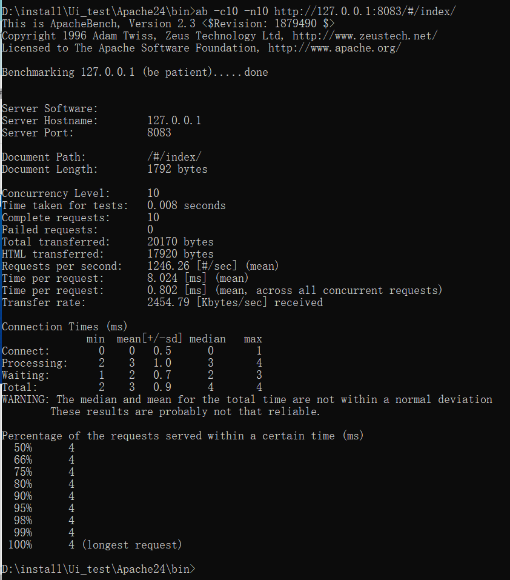
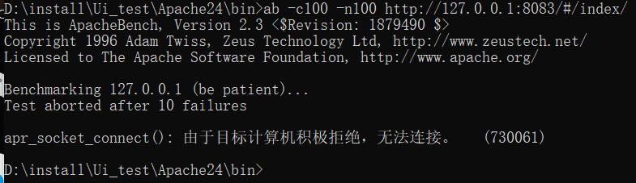
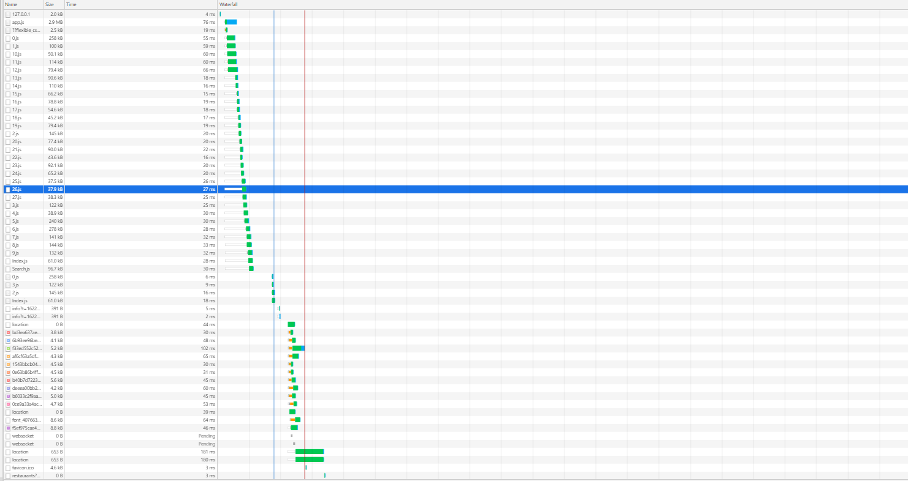
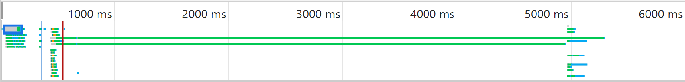
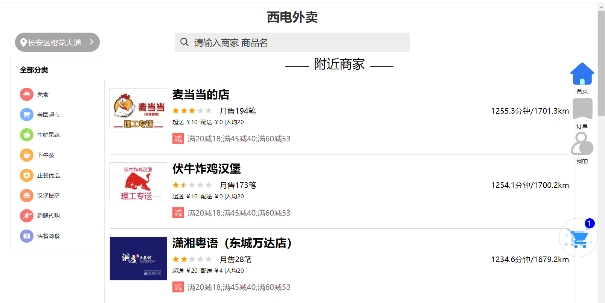
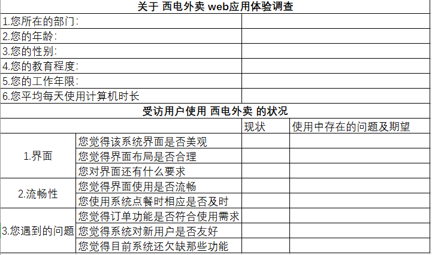

# Web应用性能和可用性分析调优


## web应用性能

### web应用性能分析

#### 网站压力测试

* 使用了Apache Bench工具进行网站压力测试

  安装网址：

  ```html
  https://www.apachehaus.com/cgi-bin/download.plx?dli=AVFhXcaNVT41ERBNjZrhnRPRVMUNlVSZETXh3QShVT
  ```

  * 下载测试工具（ab）到电脑中

  * 通过命令行打开ab测试工具

  * 进入工具文件的bin目录

    ```shell
    ab -c10 -n10 http://127.0.0.1:8083/#/index/
    ```

    (后面为启动serve后主页的url)

* 测试结果：

  **少量请求的结果**

  

  **增加请求的结果**

  

  #### 响应时间

  通过chorme检查的network中的 “time” 和 "waterfall" 属性，可以得到如下结果：

  

  **running** **time**:

  

### web应用性能提升策略

* 性能指标：（单位：ms）
  * 请求数量
  * 连接时间
  * 处理时间
  * 等待时间
  * 总时长
* 从数据来看，对于少量的请求，即使请求元素最复杂的主页，总共的处理时间也能保持在1秒内，这样的速率对于点餐的用户来说，是可以接受的。
* 对于数量稍微大一些的请求，服务端不能处理事务，测试失败，说明系统的抗压能力和并发能力较差，需要采取方法解决压力问题。
* 提升策略：
  * 采用缓存技术
  * 减少Web页面中的HTTP请求，可以考虑对页面元素的重新设计，控制加载的数据量。
  * 使用代理服务器，通过租赁更快、容量更大的云服务器代替本地服务器，服务器的处理速率会提升。

## web应用可用性

### web可用性原则

易学性和容记性：“西电外卖”应用界面和大多数的外卖应用设计框架相近，上手简单，只需要登录（未注册可直接注册），定位（自动），选餐加入购物车，购物车增删改查，订单提交，订单查看。

有效性：主页设计划分为三个模块：分类，内容，导航栏。需求一目了然，用户可以快速完成点餐的功能。

 主页如下：



效率：在正确地使用下，用户从选餐 - >下单 - > 支付，操作连续流畅。

容错率：主要体现在两部分：

（1）页面点击错误：可以通过返回键直接回到浏览历史的上一界面。

（2）订单选择错误：如果订单中添加了错误的菜品，订单并未直接提交，提供了二次修改的机会；如果定位功能存在偏差，可以自行填写收货地址，保证订单的准确性。

用户满意度：简洁，简单，界面切换流畅，没有广告。


### 移动可用性

* 该外卖系统目前处于web网页的形式，对于手机移动端浏览页面时，屏幕小，使用不方便。
* 架构设计不完整，在后续的版本增加功能时，可能会面临需要重新构建布局的问题。

* 首页完成了如下任务：
  * 标识和使命。突出的口号
  * 层次（分类）
  * 搜索
  * 内容推荐

###  可用性评估

在完成应用的阶段，使用了用户调查法：

问卷内容如下：




#### 问卷汇总结果：

* 调查的对象大多为周围学生，对一般外卖应用的比较熟悉，一些问题不能明显反映。
* 系统界面布局过于简单，缺少了吸引力。
* 外卖系统设计简介，在逻辑上不够严谨，存在一些瑕疵，如：支付方式，内容的分类方式。
* 作为商用应用，没有设计留有商用广告的界面，说明对后面系统的运营和维护认识还不够。

### 可用性提升策略

* 将服务端和数据库部署到云上，使应用程序具有高可用性。
* 使用专业的UI美工，对页面布局进行设计。
* 增加 'help' 页面，用于简单介绍系统使用方式和解决遇到的问题。
* 不仅限于web页面的方式，可以先以小程序的方式试运行。

